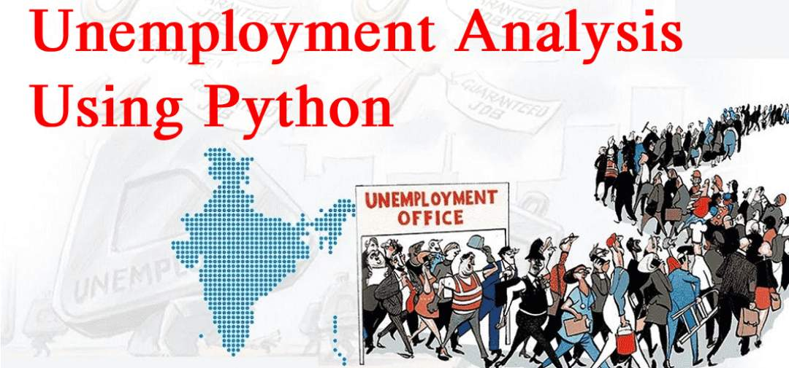

# 📊 Unemployment Analysis in India 🇮🇳

This project analyzes the **unemployment rates in India** up to November 2020 using Python-based data science tools. The dataset is visualized and processed to extract trends, regional differences, and unemployment patterns across different states and time periods.



---

## 🔍 Objective

The goal of this project is to:
- Explore the unemployment rate data of Indian states over time.
- Understand which states are more affected.
- Visualize patterns using interactive and static plots.
- Generate insights that can be useful for policy recommendations.

---

## 📁 Dataset

- **Name**: `Unemployment_Rate_upto_11_2020.csv`
- **Source**: [CMIE (Centre for Monitoring Indian Economy)](https://unemploymentinindia.cmie.com/)
- **Fields**:
  - `Region`
  - `Date`
  - `Frequency`
  - `Estimated Unemployment Rate (%)`
  - `Estimated Employed`
  - `Estimated Labour Participation Rate (%)`
  - `Area`

---

## 🛠️ Technologies Used

- Python 3.x
- NumPy
- Pandas
- Matplotlib
- Seaborn
- Jupyter Notebook

---

## 📊 Features

- Data Cleaning and Renaming Columns
- Time-Series Analysis by Month and Year
- Heatmaps of unemployment by region
- Bar plots and line plots for better trend understanding
- Graph styling for better readability

---

## 📈 Visualizations Included

- Monthly trends of unemployment rate
- State-wise unemployment comparison
- Regional heatmaps using Seaborn

---

## 🚀 How to Run

1. Clone the repository:
    ```bash
    git clone https://github.com/yourusername/unemployment-india-analysis.git
    ```
2. Navigate to the project directory:
    ```bash
    cd unemployment-india-analysis
    ```
3. Install dependencies:
    ```bash
    pip install -r requirements.txt
    ```
4. Open the Jupyter Notebook:
    ```bash
    jupyter notebook
    ```

---

## 📌 Insights Gained

- Northern and Eastern states showed higher unemployment in certain months.
- Some regions showed recovery signs post mid-2020.
- Labour participation dropped during early COVID-19 lockdown months.


---

## 🙋‍♂️ Author

**Avinash Gour**  
Final Year B.Tech (Mathematics and Computing)  
MITS Gwalior  
[LinkedIn](https://www.linkedin.com/in/avinashgour/) | [GitHub](https://github.com/avinashgour)

